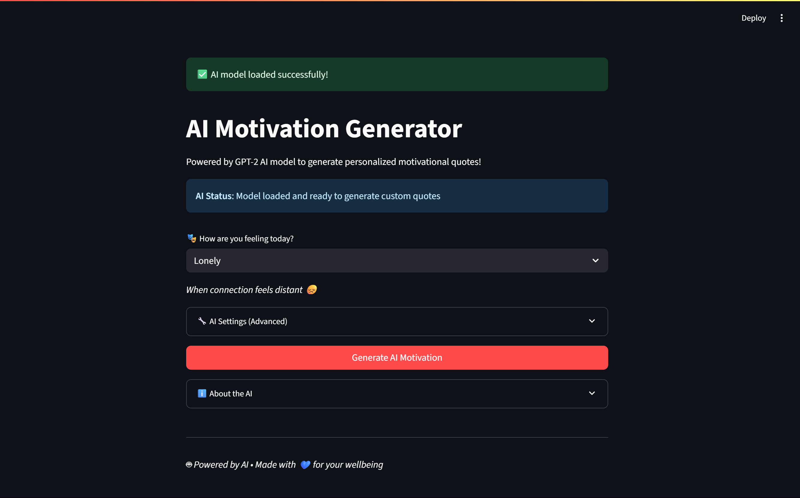

# 🤖 AI Motivation Generator

Welcome to the **AI Motivation Generator** — a mood-based motivational quote generator powered by GPT-2 and Streamlit!

🌟 [Try the Live App →](https://ai-motivation-generator-e7izloueoeivwdsudzwkqm.streamlit.app)

---

## 💡 What It Does

This app generates uplifting and personalized motivational quotes based on how you're feeling. Whether you're tired, stressed, anxious, or just need focus — this app has your back.

- 🎭 Choose your mood
- 🧠 GPT-2 generates a custom quote just for you
- 📚 If the AI fails, fallback curated quotes are used
- 🎨 Beautiful UI with calming design

---

## 📸 Preview

 *(Optional - add a screenshot to your repo)*

---

## ⚙️ How It Works

- **Frontend**: Built using [Streamlit](https://streamlit.io/)
- **Backend**: Uses [Hugging Face Transformers](https://huggingface.co/transformers/) to load a GPT-2 model
- **Fallback**: A curated quote set is used when AI output is invalid
- **Model**: GPT-2 Medium (or GPT-2 fallback for resource constraints)

---

## 🛠️ Tech Stack

- Python 🐍
- Streamlit 🌐
- Hugging Face Transformers 🤗
- PyTorch 🔥

---

## 🚀 Run Locally

```bash
git clone https://github.com/your-username/AI-Motivation-Generator.git
cd AI-Motivation-Generator
pip install -r requirements.txt
streamlit run app.py
